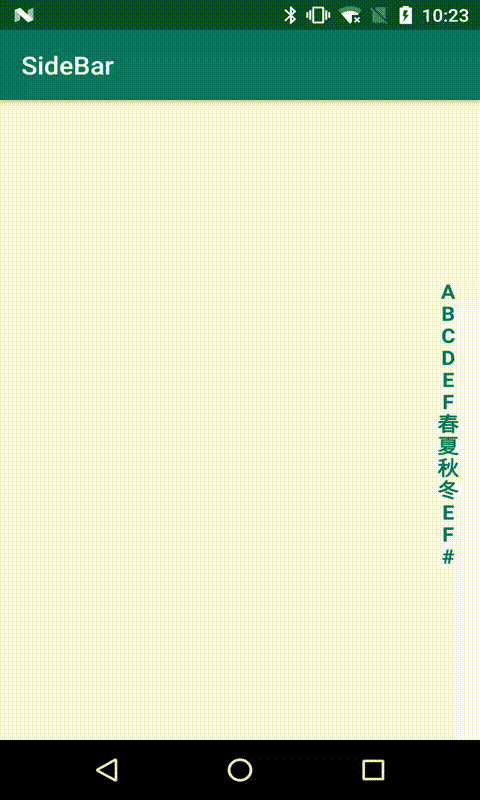

# SideBar
A sidebar widget for Android, use to show contact list.
Easy to import and use, clean and friendly, not include any unnecessary part.

## Preview


## Import
- implementation 'com.github.spinel:sidebar:1.0.3'

## Usage
- Layout
```
    <com.github.spinel.sidebar.SideBar
        ...
        
        app:textColorNormal="@color/colorNormal"
        app:textColorPressed="@color/colorBelowFingerPressed"
        app:textSize="16sp "
    />
```

- Use in Kotlin (prefer)
```
    sideBar.initials = (arrayOf("A", "B", "C", "D", "E", "F", "春", "夏", "秋", "冬", "E", "F", "#"))
    sideBar.hintView = hintView
    sideBar.callback = { pos, initial -> Log.i("info", "$pos -> $initial") }
```

- Use in Java
```
    sideBar.setInitials(new String[]{"A", "B", "C", "D", "E", "F", "春", "夏", "秋", "冬", "E", "F", "#"});
    sideBar.setHintView(hintView);
    sideBar.setCallback(new Function2<Integer, String, Unit>() {
        @Override
        public Unit invoke(Integer pos, String initial) {
            Log.i("info", pos + " -> " + initial);
            return null;
        }
    });
```